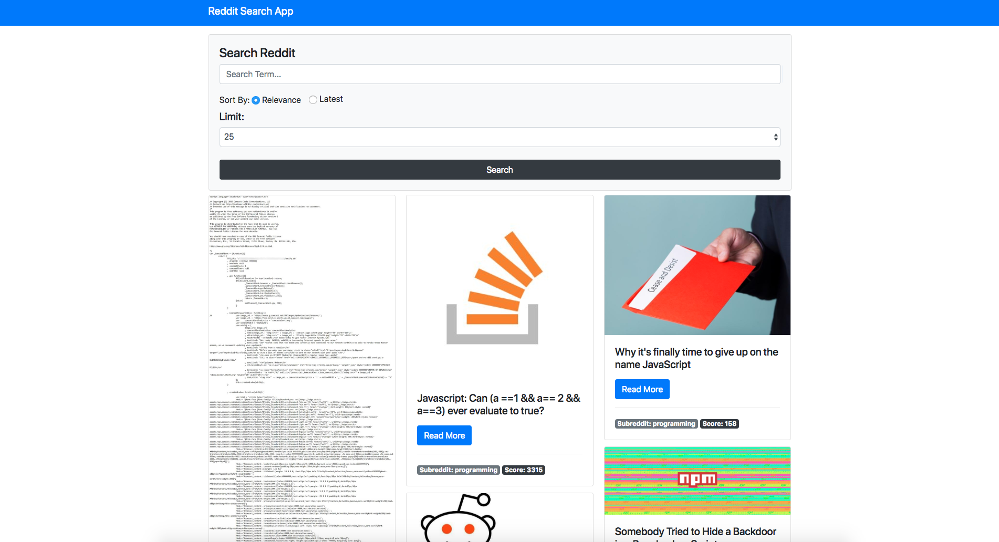

## Reddit Search App

Uses ES6, Fetch, and Parcel web application bundler to search the Reddit API and
return the image, title, text, category, and score for Reddit posts.  If no
image, the Reddit logo displays.

```parcel index.html``` to run on localhost:1234
